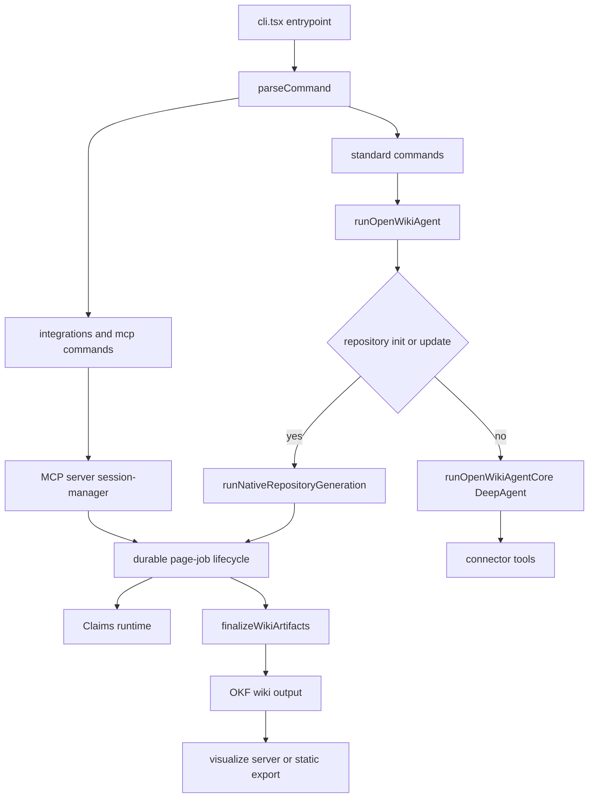

# Architecture Overview

OpenWiki is a CLI that writes and maintains a Markdown wiki for a code
repository or for a person's connected knowledge sources. An agent reads the
sources, synthesizes a linked wiki the user owns, and keeps it current. This
page maps the top-level pieces and the two axes that shape almost every runtime
decision: **which mode** (code vs personal) and **which driver** (OpenWiki's own
model vs a host coding agent). Deeper mechanisms live in the related pages linked
throughout.

## The two axes

OpenWiki's behavior is organized along two independent distinctions.

**Mode** decides what is documented and where output lands. `code` mode
documents the current Git repository and writes to `openwiki/` in that repo;
`personal` mode documents connected sources and writes to `~/.openwiki/wiki`.
The CLI defaults to `code`; the `personal` positional or `--mode personal`
selects the personal brain. See [Two modes](../concepts/two-modes.md).

**Driver** decides which model and tools do the authoring. In _native_
generation, OpenWiki resolves a configured provider, builds its own chat model,
and runs its own DeepAgents workers. In _host-driven_ generation, a coding agent
(Codex, Claude Code, or OpenCode) uses its own authenticated model and native
repository tools, while OpenWiki exposes the durable page-job lifecycle over MCP
and owns validation and finalization. Host-driven runs currently support only
repository code wikis, not personal brains.

Caption: High-level component relationships from the CLI through native and
host-driven generation to OKF output and the visualizer.

## CLI entrypoint

The executable `cli.tsx` registers a crash guard, parses `process.argv` with
`parseCommand`, and dispatches. Integration and MCP commands are handled
separately from the standard rendering pipeline; everything else flows through
`runStandardCommand`, which optionally loads the OpenWiki environment, resolves
the effective startup command, and then either runs auth, ngrok, cron, ingest,
or visualize handlers, prints a startup error, runs non-interactively in print
mode, or renders the interactive Ink TUI.

`parseCommand` produces a discriminated `CliCommand` union whose `run` variant
carries the resolved `command` (`init`, `update`, `chat`), `mode`
(`personal` or `code`), model id, print flag, and user message. Auth, ingest,
cron, visualize, integrations, and mcp are distinct command kinds routed to
their own runners.

## Agent runtime

`runOpenWikiAgent` is the shared entrypoint for model-driven work. It loads the
`~/.openwiki/.env` environment, syncs bundled skills, and then branches on
whether this is a repository generation run — `outputMode === "repository"`
combined with an `init` or `update` command. Repository generation is delegated
to `runNativeRepositoryGeneration`; every other case (personal-mode runs,
chat, ingestion synthesis) builds a DeepAgents graph via the core path.

The core path resolves run configuration (provider, credentials, model id,
retry count, output-token and stream-idle limits) before constructing a model,
so credential and availability failures are tagged to the config stage and
surface before any agent starts. `createOpenWikiAgent` is the lower-level
factory that assembles a DeepAgent graph from an already-initialized model; it
refuses repository `init`/`update` because those must go through the durable
page-job runner. More detail lives in
[Agent runtime](agent-runtime.md).

## Native repository generation

`runNativeRepositoryGeneration` drives the same durable lifecycle the host
integrations use, but with OpenWiki's own model. It begins or resumes a run,
runs a bounded planner when the run is in the planning phase, runs one fresh
per-page worker for each pending page job, and finalizes. Each worker is a
non-delegating DeepAgent: the planner gets read-only filesystem tools plus
`submit_plan`; page workers additionally get `write_file`/`edit_file` plus
`submit_page`, and the general-purpose `task` delegation tool is stripped so
workers cannot spawn subagents.

The lifecycle is resumable and self-correcting. If finalization detects that
repository source drifted underneath the plan, the run replans and repeats.
Correctable submission rejections are returned to the worker as error-status
tool messages so it can fix and resubmit rather than aborting the run. The
end-to-end flow is documented in
[Repository generation workflow](../workflows/repository-generation.md).

## Host-driven (coding-agent) generation

An installed coding-agent integration runs the same lifecycle over MCP instead
of launching an OpenWiki model. The MCP server exposes exactly five
transport-neutral tools — `openwiki_begin`, `openwiki_submit_plan`,
`openwiki_next_page`, `openwiki_submit_page`, and `openwiki_finish` — backed by
a session manager that holds at most one active process-local run and rejects
any operation whose `runId` does not match. The coding agent owns repository
research, planning, and factual authoring; OpenWiki owns the durable queue,
Claims validation and persistence, source-drift handling, and deterministic
finalization. Host-driven runs use only repository source and tests; connector
context is not yet available to them.

## Claims

For repository code wikis, OpenWiki tracks the material propositions behind
each page, not just when the Markdown was regenerated. A run rebuilds a strict
process-local Claims runtime from durable state; each page worker receives the
complete existing Claim set and submits the complete intended replacement set,
so unchanged Claims keep their IDs and refresh evidence versions, revised
Claims update in place, new Claims get IDs, and omitted Claims are retracted.
Claim state is persisted alongside the Markdown under `openwiki/.claims/`, and
page completion is a durability boundary that persists reconciled Claims before
marking the job done. Grounded Claims apply to repository evidence only.

## OKF output and finalization

Every wiki is an Open Knowledge Format bundle. Each page begins with concept
frontmatter, and finalization is deterministic: `finalizeWikiArtifacts`
validates Mermaid fences (degrading unparseable ones to text), synchronizes wiki
indexes, validates internal links, synchronizes Claim sources, and finalizes
generated provenance with a producer actor and timestamp. See
[OKF output](../concepts/okf-output.md).

## Connectors and personal-mode ingestion

In personal mode, `runOpenWikiIngestion` walks the configured source instances
from onboarding config, runs each connector, and synthesizes the wiki. For
deterministic connectors it first pulls raw data and manifests under
`~/.openwiki/connectors/<connector>/raw/`, then runs a source-specific agent
that writes into `~/.openwiki/wiki`. The same connector type can be configured
multiple times as separate instances (for example `web-search-1` and
`web-search-2`). Connectors ingest over a rolling window and can be run for all
sources or one target at a time.

## Visualization

`openwiki visualize` turns any wiki into an interactive node graph beside a live
Markdown reader. Without `--export` it serves the wiki directory on a local
loopback address with live reload; with `--export` it writes a self-contained
static site (`index.html`, `client.js`, `client-lib.js`, `styles.css`,
`graph.json`) suitable for GitHub Pages or any static host.

## Where to go next

- [Agent runtime](agent-runtime.md) — model resolution, DeepAgent graph, workers.
- [Source map](source-map.md) — file-level orientation.
- [Two modes](../concepts/two-modes.md) — code vs personal in detail.
- [OKF output](../concepts/okf-output.md) — the output format and finalization.
- [Repository generation workflow](../workflows/repository-generation.md) — the durable lifecycle end to end.
